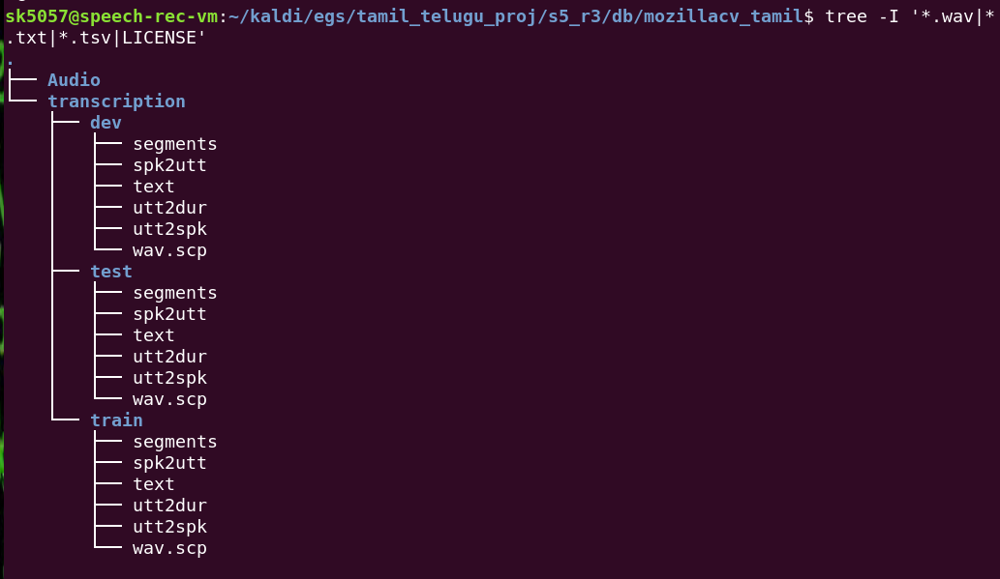
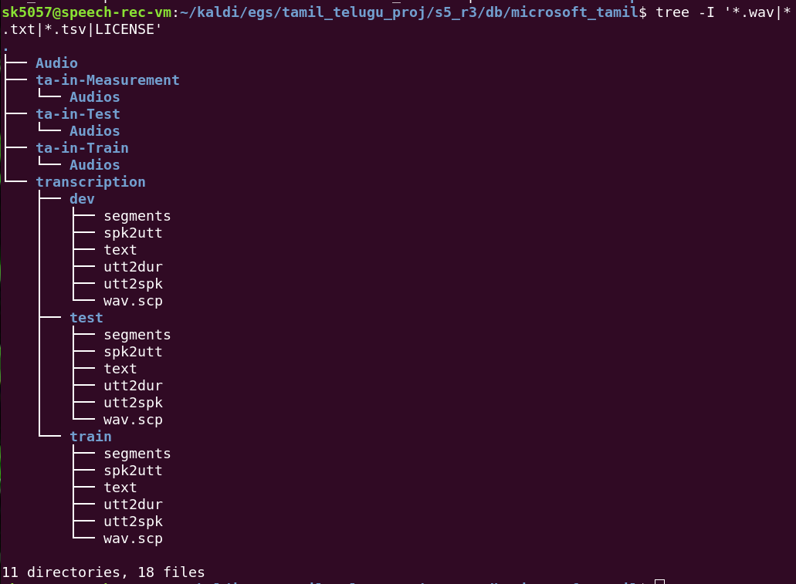
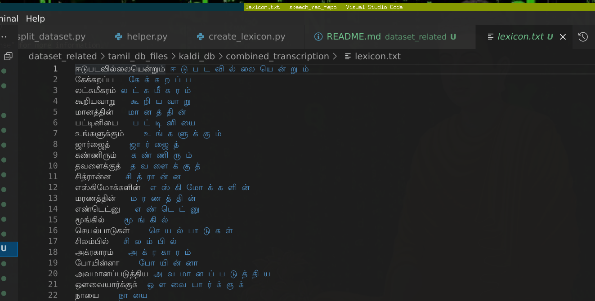

# Audio and Transcript Preprocessing steps
- Convert all files to `.wav` format : [convert_mp3towav.sh](convert_mp3towav.sh))
  - Sample Rate    : 16000
  - Precision      : 16-bit
  - Sample Encoding: 16-bit Signed Integer PCM
- For all the datasets except `iitm_asr` (which already comes with utterance divisions), the duration of audios are small. So used each file as an utterance itself. [total_time_in_dir.py](total_time_in_dir.py)
```
sk5057@speech-rec-vm:~/asr_project/datasets$ python3 -u  dataset_repo_folder/total_time_indir.py cv-corpus-8.0-2022-01-19/ta/wavclips/ | tee dataset_repo_folder/cv-corpus-8.0-2022-01-19_ta_duration.log
Total number of files: 197733
Total time in seconds: 1222649.6676870075
Total time in minutes: 20377.494461450126
Total time in hours: 339.6249076908354
Minimum time: 0.036
Maximum time: 20.34
Average time: 6.18333645717714
```
- Split each dataset into partitions of `dev, test, train` [split_dataset.py](split_dataset.py)
- Create the necessary kaldi files for each dataset [create_data_files.py](create_data_files.py)


- Combine the files into a single dataset ensuring unique ids for files, utterances, speakers etc. [merge_datasets.py](merge_datasets.py)
  - Investigated use of [Unified Parser](unifiedparser_original/) to create the pronunciations for the lexicon but didn't have success in fixing the segmentation fault after spending a lot of time. TODO: Use gdb and tools to better debug.
  - Create lexicon with the pronunciation - [lexicon.txt](tamil_db_files/kaldi_db/combined_transcription/lexicon.txt)) using [create_lexicon.py](create_lexicon.py) by simple splitting words into unicode characters

```
sk5057@speech-rec-vm:~/kaldi/egs/tamil_telugu_proj/s5_r3/db/combined_transcription$ tree -I '*.wav|*.tsv|LICENSE'
.
├── dev
│   ├── segments
│   ├── spk2utt
│   ├── text
│   ├── utt2dur
│   ├── utt2spk
│   └── wav.scp
├── lexicon.txt
├── test
│   ├── segments
│   ├── spk2utt
│   ├── text
│   ├── utt2dur
│   ├── utt2spk
│   └── wav.scp
└── train
    ├── segments
    ├── spk2utt
    ├── text
    ├── utt2dur
    ├── utt2spk
    └── wav.scp

3 directories, 19 files
```


